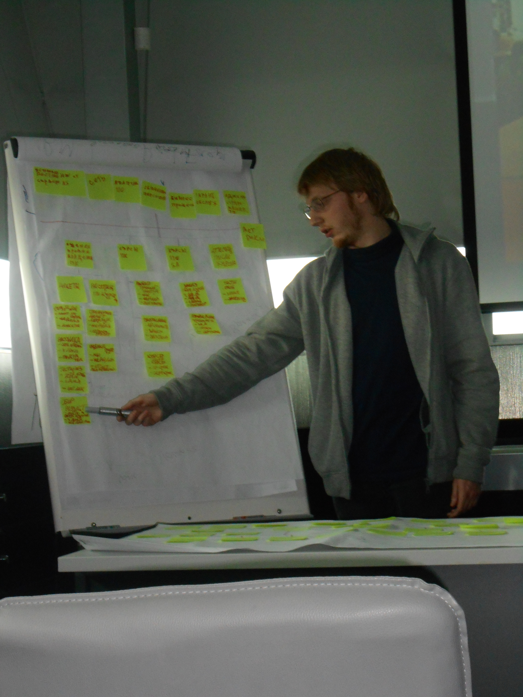

- Developed and authored an educational guide on "File Systems" for the Operating Systems discipline.
- Conducted practical sessions on "File Systems" for students in the classroom, providing instructional materials and hands-on guidance.
- Hosted live help sessions and provided individualized support to learners.

Skills: Teaching · Operating Systems · Virtual Machines

