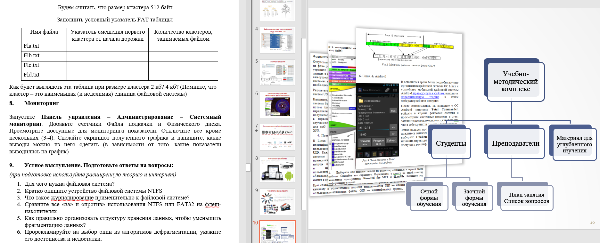

- Разработка методических образовательных материалов по теме "Файловые системы" для учебного курса "Операционные системы".
- Проведение практических занятий по теме "Файловые системы". Проведение классных занятий со студентами по разработанным учебным материалам и практическому пособию.
- Индивидуальная работа со студентами, консультация по учебному курсу.

Навыки: Преподавание · Операционные системы · Виртуальные машины
