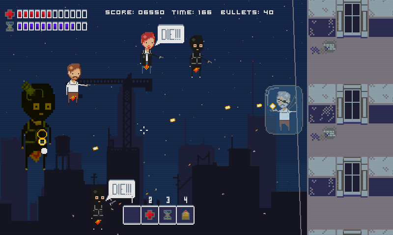
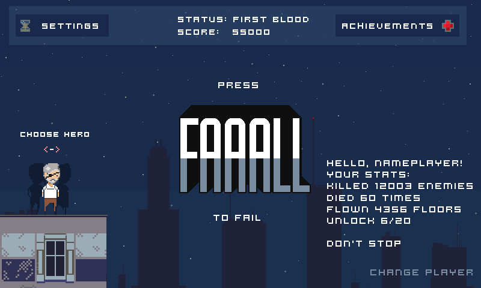
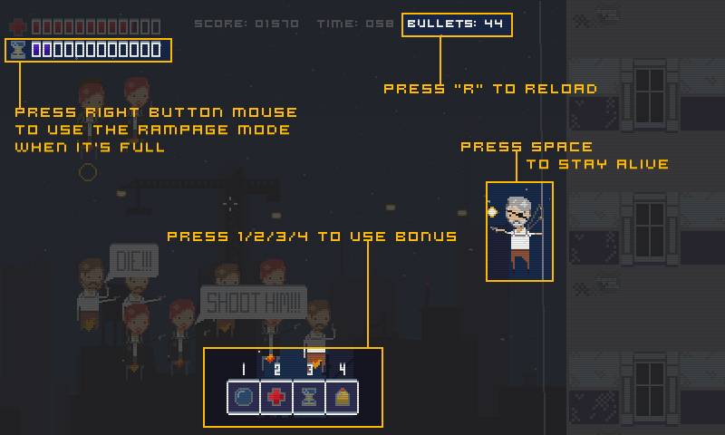

Имел удовольствие принять участие в разработке маленькой хардкорной игры FAAAAAALL. Мой вклад:

* скрипты на GML (GameMaker Studio)
* некоторые геймплейные элементы
* часть анимированных 2D эффектов

К сожалению, проект был заброшен по причине ухода лидера и 2D-художника (в одном лице)

